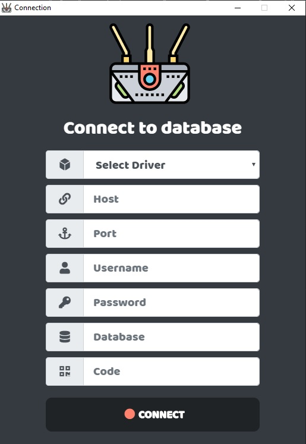

# Gateway Database

The system connects to an external database. This system will help solve problems. When you are not able to connect to an external server using a VPN method or another method. The working principle of this program is websocket  server emit event  send to The client (Electron) that is connected to the database. You should have to separate the server folder outside of this app. But which I included because I didn't want to separate positions

## Install

```bash
git clone https://github.com/Anechasun/gateway-database.git
cd gateway-database

npm install
```

## Script

#### Start server

```bash
npm run start-server
```

#### Start app

```bash
npm start
```
#### Develop
```bash
npm run start-dev
npm run webpack-w
```

#### Lints and fixes files

```bash
npm run lint
```

#### Testing
```bash
npm test
```

#### Build App

```bash
npm run build
```

## To use

#### Screen Connect Database

**`Driver`**: driver database

**`Host`**: Server to connect to

**`Port`**: Port to connect

**`Username`**: User name to use for authentication

**`Password`**:  Password to use for authentication

**`Database`**: Database to connect to (default: dependent on server configuration).

**`Code`**: client code



#### Server connect Client
example [see](https://github.com/Anechasun/gateway-database/blob/master/server/index.js#L21) line 21:30

```bash
curl -X GET \
  'http://localhost:3000/query?sql=SELECT * FROM users'
```


