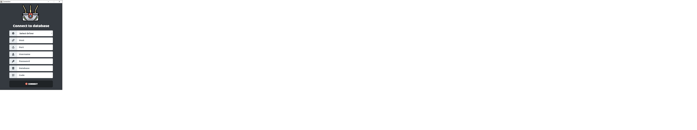
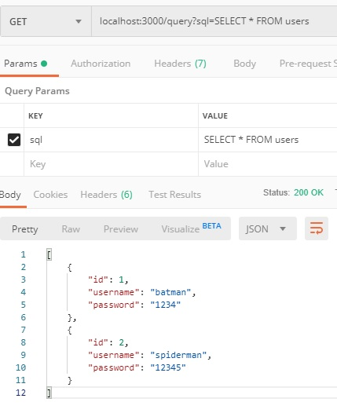

# Gateway Database

ระบบดึงข้อมูล Database ภายนอก ระบบนี้จะช่วยแก้ปัญหา เมือคุณไม่สามารถเชื่อมต่อกับ server ภายนอกได้ด้วยวิธี VPN และวิธีอืนๆ หลักการทำงานของโปรแกรมนี้ จะให้ server TCP ควบคุมตัวโปรแกรม Electron ที่ได้เชื่อมต่อกับ database ให้ทำการดึงข้อมูลตามที่ server ได้ส่ง Sql ไป

## การติดตั้ง

```bash
git clone https://github.com/Anechasun/gateway-database.git
cd gateway-database

npm install
```
## เซิร์ฟเวอร์

อันที่จริง server ควรไปติดตั้งอยู่ที่ server ที่คุณต้องการ แต่ผมให้มันอยู่ใน project นี้เพราะผมไม่ต้องแยก Repo ออกจากกันและทำให้การทำสอบแอพงานขึ้น

```bash
npm run start-server
```

## client

client ก็คือตัวโปรแกรม ที่เชื่มต่ออยู่กับ database

```bash
# production
npm start

# development
npm run start-dev

# build .EXE
npm run build
```

### Screen Connect Database


### Server Server Query

